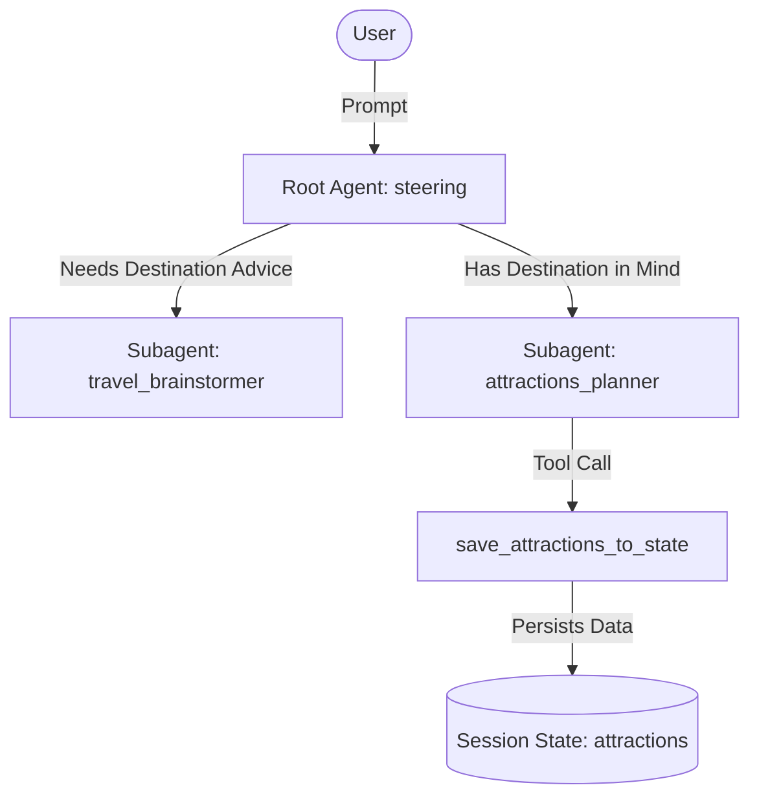
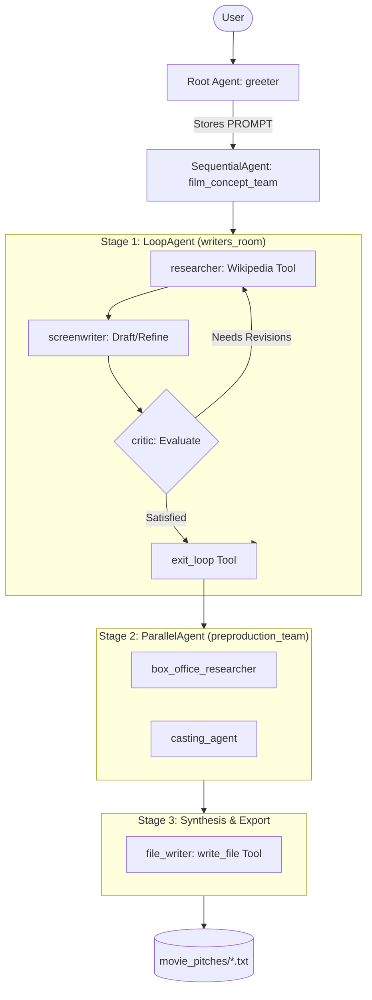

# Multi-Agent Systems with Google Agent Development Kit (ADK)

[](https://www.python.org/downloads/)
[](https://github.com/google/adk)
[](https://cloud.google.com/vertex-ai)
[](design.md)

An enterprise-ready implementation of advanced multi-agent architectures built with the **Google Agent Development Kit (ADK)** and powered by **Gemini on Google Cloud Vertex AI**.

This repository demonstrates two distinct, battle-tested multi-agent patterns:
1. **Hierarchical Routing (Parent & Subagents)**: Intent classification, delegation, and conversational state accumulation.
2. **Composite Workflow Orchestration**: Deterministic coordination using **Sequential**, **Loop (Autonomous Refinement)**, and **Parallel** agent primitives with tool-driven validation and automated artifact generation.

---

## 📑 Table of Contents

- [Overview & Architectures](#-overview--architectures)
  - [1. Parent & Subagents Pattern (`parent_and_subagents`)](#1-parent--subagents-pattern-parent_and_subagents)
  - [2. Workflow Multi-Agent Pattern (`workflow_agents`)](#2-workflow-multi-agent-pattern-workflow_agents)
- [Repository Structure](#-repository-structure)
- [Quick Start](#-quick-start)
  - [Prerequisites](#prerequisites)
  - [Installation](#installation)
  - [Configuration](#configuration)
- [Execution Modes](#-execution-modes)
  - [Option 1: Interactive Web UI (`adk web`)](#option-1-interactive-web-ui-adk-web)
  - [Option 2: Interactive Terminal CLI (`adk run`)](#option-2-interactive-terminal-cli-adk-run)
- [Why We Chose Each Option](#-why-we-chose-each-option)
- [Sample Artifacts](#-sample-artifacts)
- [Documentation Deep Dive](#-documentation-deep-dive)

---

## 🏛 Overview & Architectures

### 1. Parent & Subagents Pattern (`parent_and_subagents`)
A hierarchical steering model where a root agent acts as an intent router, evaluating user goals and delegating tasks to domain-specialized subagents:
- **`steering` (Root Agent)**: Evaluates user intent to route between exploratory travel inspiration and structured itinerary planning.
- **`travel_brainstormer`**: Conversational agent guiding destination selection based on traveler interests (adventure, culture, leisure).
- **`attractions_planner`**: State-aware agent utilizing the custom tool `save_attractions_to_state` to dynamically persist and recall selected destinations in the session state (`tool_context.state["attractions"]`).



### 2. Workflow Multi-Agent Pattern (`workflow_agents`)
An autonomous multi-stage production pipeline for film concept generation, blending collaborative loops, concurrent execution, and deterministic sequencing:
- **`greeter` (Root Agent)**: Captures user concept input, stores it in state (`PROMPT`), and triggers the pipeline.
- **`film_concept_team` (`SequentialAgent`)**: Orchestrates 3 sequential stages:
  1. **`writers_room` (`LoopAgent`, Max 5 Iterations)**:
     - **`researcher`**: Fetches verified historical context via `WikipediaQueryRun` (LangChain Tool wrapper) and writes to state (`research`).
     - **`screenwriter`**: Drafts/revises loglines and 3-act plot outlines based on research and critique (`PLOT_OUTLINE`).
     - **`critic`**: Reviews outline against 4-point cinematic criteria. Emits feedback to `CRITICAL_FEEDBACK` or calls the `exit_loop` tool to conclude iteration.
  2. **`preproduction_team` (`ParallelAgent`)**:
     - **`box_office_researcher`**: Analyzes market comparables and commercial box office viability concurrently.
     - **`casting_agent`**: Suggests acclaimed casting choices aligned with the characters concurrently.
  3. **`file_writer` (`Agent`)**:
     - Synthesizes outline, box office report, and casting package, naming and writing a markdown pitch document to disk via `write_file`.



---

## 📁 Repository Structure

```text
.
├── callback_logging.py           # Observability callbacks (query/response logging)
├── requirements.txt              # Production dependencies (google-adk, langchain, etc.)
├── .env.example                  # Environment variable template
├── .gitignore                    # Secrets, virtualenv, and cache exclusions
├── README.md                     # Project overview and entrypoint
├── design.md                     # Deep architectural analysis and design rationale
├── instructions.md               # Step-by-step setup and operational run guide
├── movie_pitches/                # Artifact directory for generated pitch documents
│   ├── Poetical Science.txt      # Generated Ada Lovelace production package
│   └── enchantress_of_numbers.txt# Generated Ada Lovelace narrative pitch
├── parent_and_subagents/         # Hierarchical Parent-Subagent Implementation
│   ├── __init__.py
│   └── agent.py                  # Steering agent + travel brainstormer + attractions planner
└── workflow_agents/              # Composite Workflow Multi-Agent Implementation
    ├── __init__.py
    └── agent.py                  # Sequential + Loop + Parallel agents + Wikipedia tools
```

---

## 🚀 Quick Start

### Prerequisites
- Python **3.10+**
- Google Cloud Project with **Vertex AI API** enabled (`aiplatform.googleapis.com`)
- Google Cloud CLI authenticated via Application Default Credentials (`gcloud auth application-default login`)

### Installation
```bash
# Clone the repository
git clone https://github.com/sayem041088/Multi-Agent-System-with-ADK.git
cd Multi-Agent-System-with-ADK

# Create and activate virtual environment
python3 -m venv .venv
source .venv/bin/activate

# Install dependencies
pip install -r requirements.txt
```

### Configuration
Copy the template and configure your GCP Project settings:
```bash
cp .env.example .env
```
Edit `.env`:
```ini
GOOGLE_GENAI_USE_VERTEXAI=TRUE
GOOGLE_CLOUD_PROJECT="your-google-cloud-project-id"
GOOGLE_CLOUD_LOCATION=global
MODEL="gemini-3.8-flash"
```

---

## 💻 Execution Modes

You can run both agent systems using either the interactive Web UI or the terminal CLI.

### Option 1: Interactive Web UI (`adk web`)
Launches a rich FastAPI-powered graphical web interface providing visual trace timelines, tool execution logs, and live state inspection:

```bash
adk web .
```
- Open **`http://127.0.0.1:8000`** in your browser.
- Select either `parent_and_subagents` or `workflow_agents` from the top navigation dropdown.

### Option 2: Interactive Terminal CLI (`adk run`)
Launches a lightweight interactive CLI directly in your terminal:

```bash
# Run Hierarchical Travel Agent
adk run parent_and_subagents

# Run Autonomous Film Concept Workflow
adk run workflow_agents
```

---

## ⚖️ Why We Chose Each Option

| Architectural Choice | Why It Was Chosen | Alternatives Considered | Why Alternative Was Rejected |
| :--- | :--- | :--- | :--- |
| **Hierarchical Router (`parent_and_subagents`)** | Isolates conversational contexts and avoids bloated monolithic prompts. Specialized instructions yield higher accuracy. | Single mega-prompt with conditional branches. | Mega-prompts suffer from prompt drift, tool hallucination, and degraded instruction following as context expands. |
| **Autonomous Loop (`writers_room`)** | Allows self-correcting iterative refinement between writer and critic until quality thresholds are met. | Single-pass generation or static N-step chain. | Single-pass outputs contain factual inaccuracies or poor structure; static chains cannot stop early when the outline is already optimal. |
| **Concurrent Execution (`preproduction_team`)** | Runs box office analysis and casting generation in parallel, reducing latency by ~50% for this phase. | Sequential execution. | Unnecessary serialization since neither subagent depends on the other's output (both consume `PLOT_OUTLINE`). |
| **Shared Session State (`ToolContext.state`)** | Decouples agents by treating state as a structured key-value store, preventing brittle string parsing. | Passing cumulative conversation history in chat messages. | Chat history injection causes context explosion and exposes raw agent prompt plumbing to downstream agents. |
| **Web UI (`adk web`) vs CLI (`adk run`)** | Web UI chosen for development & auditing (visualizes handoffs and state keys); CLI chosen for headless CI/CD & rapid iteration. | Custom Streamlit or chainlit app. | ADK's native web server automatically binds to session services, artifact directories, and telemetry with zero extra code. |

---

## 📄 Sample Artifacts

The `workflow_agents` system outputs comprehensive, production-ready pitch packages directly into `movie_pitches/`:
- **[Poetical Science.txt](file:///home/user/adk_multiagent_systems/movie_pitches/Poetical%20Science.txt)**: Features a 3-act historical biopic screenplay outline for Ada Lovelace, backed by Wikipedia research, multi-scenario theatrical box office projections ($95M–$135M base case), and star casting proposals (Saoirse Ronan, Jared Harris, Kristin Scott Thomas).
- **[enchantress_of_numbers.txt](file:///home/user/adk_multiagent_systems/movie_pitches/enchantress_of_numbers.txt)**: Alternative tight 3-act narrative pitch emphasizing Lovelace's conceptualization of Bernoulli number algorithms.

---

## 📚 Documentation Deep Dive

For exhaustive technical documentation, please consult:
- **[design.md](design.md)**: Deep dive into architectural design principles, state machines, agent choreography, prompt engineering, and observability.
- **[instructions.md](instructions.md)**: Detailed step-by-step installation, GCP authorization, CLI & Web execution modes, session persistence configurations, and troubleshooting guide.
