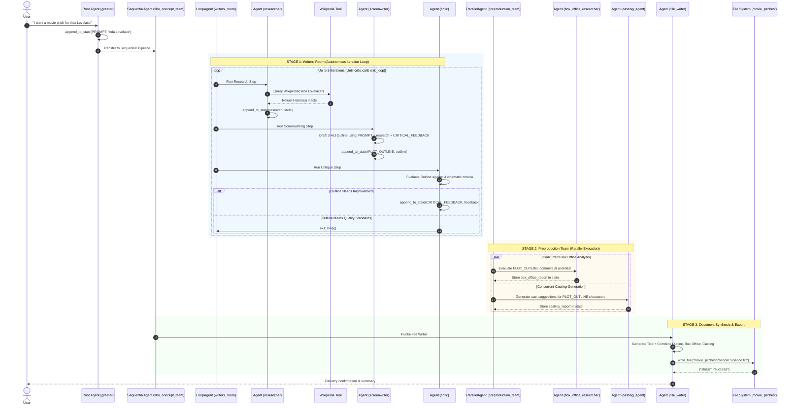

# System Architecture and Design Document

## Multi-Agent Systems with Google Agent Development Kit (ADK)

---

## 1. Executive Summary & Design Philosophy

Modern enterprise applications require generative AI systems that are reliable, auditable, and capable of executing complex workflows. While single-prompt LLM architectures are effective for basic conversational tasks, they deteriorate rapidly when asked to manage multi-step reasoning, external tool invocation, quality control, and artifact generation simultaneously.

This repository implements two production-grade multi-agent architectures using the **Google Agent Development Kit (ADK)**:
1. **Hierarchical Routing Architecture** (`parent_and_subagents`): Uses a root supervisor agent to dynamically classify user intent and route execution to specialized sub-agents with dedicated state persistence.
2. **Composite Workflow Architecture** (`workflow_agents`): Combines **Sequential**, **Loop (Iterative Refinement)**, and **Parallel** agent orchestration primitives to research, draft, critique, analyze, and generate comprehensive film pitch packages.

---

## 2. Why Multi-Agent Systems? (Architectural Rationale)

| Dimension | Monolithic Prompting (Single LLM Call) | Multi-Agent Orchestration (Google ADK) |
| :--- | :--- | :--- |
| **Context Window Hygiene** | Large cumulative prompts lead to "lost-in-the-middle" phenomena and attention degradation. | Each agent receives only the targeted state variables needed for its specific subtask (`{ PLOT_OUTLINE? }`, `{ research? }`). |
| **Separation of Concerns** | Prompts attempt to balance conflicting personas (e.g., creative writer, fact-checking researcher, harsh critic, market analyst). | Each agent operates under an unambiguous, dedicated role definition with calibrated system instructions. |
| **Deterministic Quality Gates** | Validation depends entirely on LLM self-policing in a single generation step. | Explicit review loops (`LoopAgent`) allow a designated `critic` agent to enforce quality standards or loop back with specific feedback. |
| **Execution Concurrency** | Serial generation increases total response latency linearly. | Orthogonal tasks (e.g., box office estimation and casting proposals) execute simultaneously via `ParallelAgent`. |
| **Tool Specialization** | Exposing dozens of tools simultaneously degrades tool-calling accuracy. | Tools are scoped strictly to the agents that require them (e.g., Wikipedia to `researcher`, file system to `file_writer`). |

---

## 3. Pattern 1: Hierarchical Parent & Subagents (`parent_and_subagents`)

### Architecture Diagram

```mermaid
flowchart TD
    subgraph ClientLayer["Interaction Layer"]
        User([User])
    end

    subgraph AgentLayer["ADK Agent Topology"]
        Root["Root Agent: 'steering'<br/>• Model: Gemini 3.8 Flash<br/>• Role: Intent Classifier & Router<br/>• Temp: 0.0"]
        TB["Subagent: 'travel_brainstormer'<br/>• Role: Exploratory Discovery<br/>• Instruction: Identify travel priorities"]
        AP["Subagent: 'attractions_planner'<br/>• Role: Structured Itinerary Builder<br/>• Instruction: Recommend & capture spots"]
    end

    subgraph StateLayer["Session State Storage"]
        Tool["Tool: save_attractions_to_state()"]
        State[("tool_context.state['attractions']<br/>['Eiffel Tower', 'Louvre Museum', ...]")]
    end

    User -->|Travel Query| Root
    Root -->|User undecided| TB
    Root -->|User has destination| AP
    AP -->|Invokes Tool| Tool
    Tool -->|Mutates State| State
    State -.->|Injected into prompt via { attractions? }| AP
```

### Component Breakdown

1. **`root_agent` (`steering`)**:
   - **Role**: Intent triage. It acts as an empathetic greeter that determines whether the user needs discovery assistance or has a specific country in mind.
   - **Configuration**: Uses `temperature=0` to ensure strict, deterministic routing decisions without conversational drifting.
   - **Handoff Mechanism**: Configured with `sub_agents=[attractions_planner, travel_brainstormer]`. In Google ADK, designating subagents allows the parent agent to transfer execution seamlessly when intent is resolved.

2. **`travel_brainstormer`**:
   - **Role**: Open-ended conversational discovery. Uses consultative questioning (prioritizing adventure, leisure, learning, shopping, or art) to guide users toward a destination.

3. **`attractions_planner` & State Tool**:
   - **Role**: Concrete attraction suggestion and state persistence.
   - **Tool (`save_attractions_to_state`)**:
     ```python
     def save_attractions_to_state(tool_context: ToolContext, attractions: List[str]) -> dict[str, str]:
         existing_attractions = tool_context.state.get("attractions", [])
         tool_context.state["attractions"] = existing_attractions + attractions
         return {"status": "success"}
     ```
   - **Why this design**: Rather than parsing attractions from conversational text using regex or fragile LLM parsing, the agent explicitly calls the tool. The session state becomes the authoritative data source, which can be persisted to disk, relational databases, or external services.

---

## 4. Pattern 2: Workflow Multi-Agent System (`workflow_agents`)

### Comprehensive Choreography Diagram



---

## 5. Architectural Primitives Deep Dive

### 5.1 SequentialAgent (`film_concept_team`)
- **Purpose**: Establishes strict phase-gate progression. A screenplay outline must be finalized before preproduction analysis can begin, and all reports must exist before the file writer compiles the pitch document.
- **Why Choose SequentialAgent**: Ensures zero race conditions between stages. Downstream agents are guaranteed that required state keys (`PLOT_OUTLINE`, `box_office_report`, `casting_report`) are populated before execution starts.

### 5.2 LoopAgent (`writers_room`)
- **Purpose**: Autonomous self-improvement loop between researcher, screenwriter, and critic.
- **Safety Mechanisms**:
  - `max_iterations=5`: Prevents runaway API loops and token depletion in cases where the critic remains unsatisfied.
  - Custom `exit_loop` tool: Enables the `critic` agent to break out of the loop early once the plot outline fulfills all 4 structural criteria (three-act structure, emotional engagement, historical authenticity, research incorporation).
- **Why Choose LoopAgent**: Traditional chains produce one draft and stop. By pairing the generator with a critic equipped with an explicit loop-exit tool, the system mimics human editorial review, resulting in significantly higher depth and historical accuracy.

### 5.3 ParallelAgent (`preproduction_team`)
- **Purpose**: Concurrent multi-perspective evaluation.
- **Mechanics**: Dispatches `box_office_researcher` and `casting_agent` simultaneously. Both read the identical `PLOT_OUTLINE` from state and write to separate output keys (`box_office_report` and `casting_report`).
- **Why Choose ParallelAgent**: Box office modeling does not depend on casting choices, and casting recommendations do not depend on box office numbers. Executing them concurrently reduces phase latency by approximately 50%.

### 5.4 LangChain Tool Integration Bridge
The system bridges Google ADK with the LangChain ecosystem:
```python
from google.adk.tools.langchain_tool import LangchainTool
from langchain_community.tools import WikipediaQueryRun
from langchain_community.utilities import WikipediaAPIWrapper

LangchainTool(tool=WikipediaQueryRun(api_wrapper=WikipediaAPIWrapper()))
```
- **Why Choose LangchainTool Bridge**: Rather than writing custom Wikipedia REST wrappers, ADK’s `LangchainTool` natively wraps community-standard LangChain tools, translating parameter schemas to Google GenAI function declarations automatically.

---

## 6. State Architecture & Communication Strategy

### 6.1 State as the Central Blackboard
Communication across agents does not occur via unstructured message passing; it operates through an **in-memory Blackboard pattern** managed by `ToolContext.state`:

```text
Session State Dictionary:
├── PROMPT:              "Ada Lovelace"
├── research:            ["Ada Lovelace was an English mathematician...", ...]
├── PLOT_OUTLINE:        ["Title: Poetical Science\nAct I...", ...]
├── CRITICAL_FEEDBACK:   ["Enhance Babbage's political struggles in Act II...", ...]
├── box_office_report:   "BOX OFFICE REPORT: Target $95M-$135M..."
├── casting_report:      "CASTING: Saoirse Ronan as Ada Lovelace..."
└── attractions:         ["Eiffel Tower", "Louvre Museum"] (Travel system)
```

### 6.2 Prompt State Injection (`{ KEY? }`)
ADK system prompts leverage conditional template syntax:
```text
PLOT_OUTLINE:
{ PLOT_OUTLINE? }

CRITICAL_FEEDBACK:
{ CRITICAL_FEEDBACK? }
```
The `?` modifier indicates optionality: if the key is empty during the first loop pass, it evaluates to an empty string without raising an exception. In subsequent iterations, the prompt automatically receives the accumulated history.

---

## 7. Observability, Logging & Debugging

### 7.1 Callback Interceptors (`callback_logging.py`)
To enable end-to-end auditability without modifying agent core logic, model callbacks are attached to each agent:
```python
def log_query_to_model(callback_context: CallbackContext, llm_request: LlmRequest):
    ...
def log_model_response(callback_context: CallbackContext, llm_response: LlmResponse):
    ...
```
- **`before_model_callback`**: Captures exact serialized payloads sent to Gemini, including injected state and tool call results.
- **`after_model_callback`**: Logs model completion tokens and function call requests.

### 7.2 Cloud Logging Integration
Each execution automatically initializes the Google Cloud Logging client:
```python
cloud_logging_client = google.cloud.logging.Client()
cloud_logging_client.setup_logging()
```
Logs are automatically correlated with GCP trace identifiers, enabling enterprise monitoring and compliance auditing within Google Cloud Observability.

---

## 8. Architectural Trade-Off Analysis

| Decision | Option Selected | Alternative | Trade-off Analysis |
| :--- | :--- | :--- | :--- |
| **Model Selection** | `gemini-3.8-flash` | `gemini-1.5-pro` | Flash provides 3-4x lower latency and significantly lower token costs while maintaining strong instruction-following and tool-calling fidelity required for multi-step agent loops. |
| **Generation Temperature** | `temperature=0.0` | `temperature=0.7+` | Zero temperature ensures deterministic adherence to tool-calling contracts, state formats, and exit conditions. Creativity is driven by prompt instructions rather than random sampling. |
| **Loop Control** | Agent-driven (`exit_loop` tool) | Hardcoded iteration count (e.g., exactly 3) | Hardcoded iterations waste tokens and latency if an outline is already excellent; agent-driven termination allows dynamic short-circuiting while `max_iterations=5` ensures safety. |
| **Tool Execution** | In-process Python functions | Remote microservices / HTTP REST | In-process execution eliminates network serialization overhead, ensures instant state mutation, and minimizes operational complexity. |
